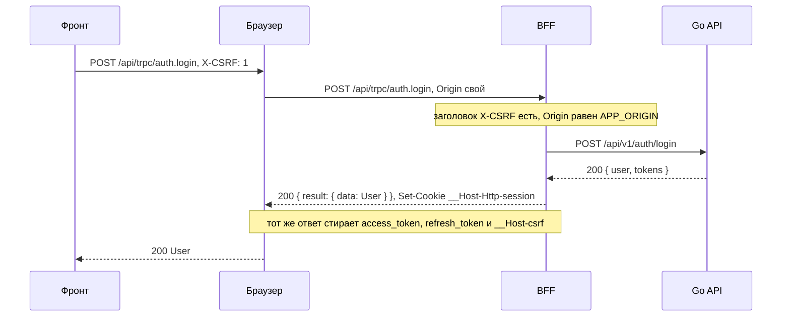
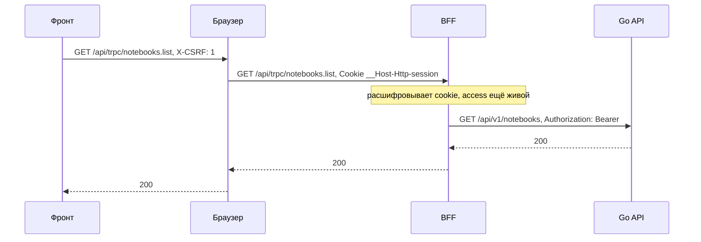
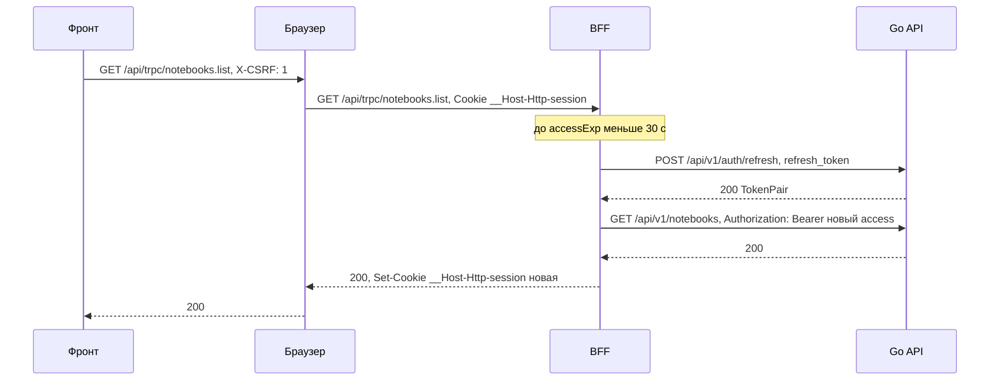
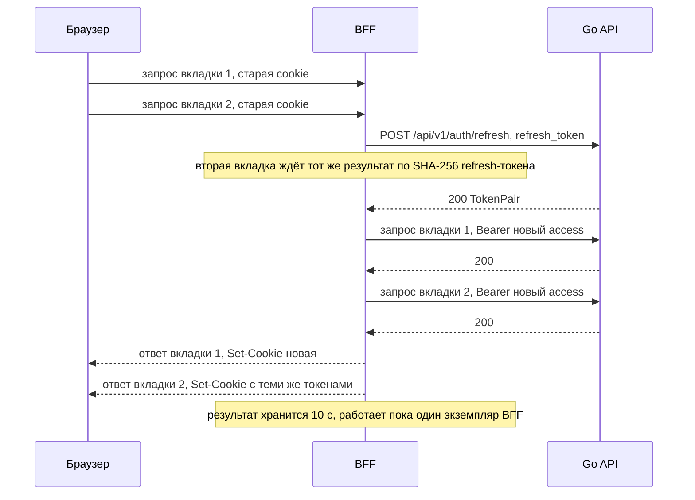
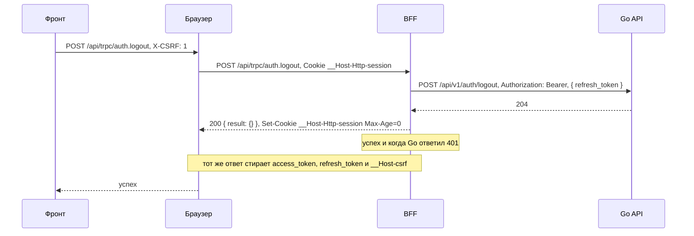
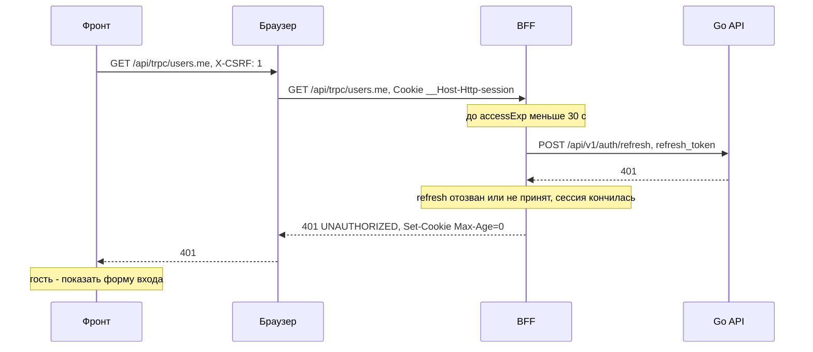
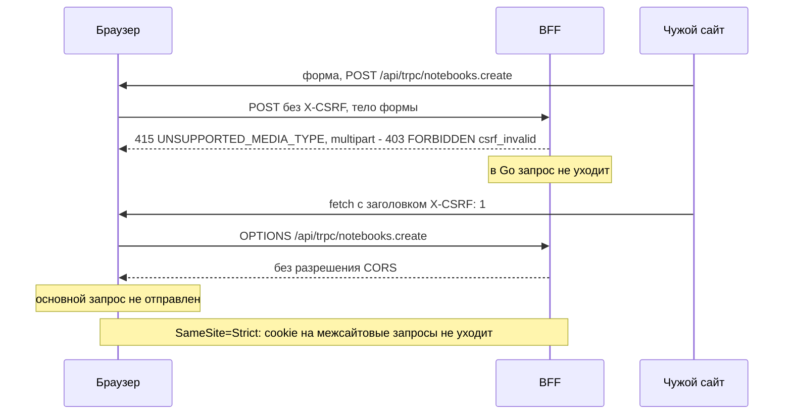
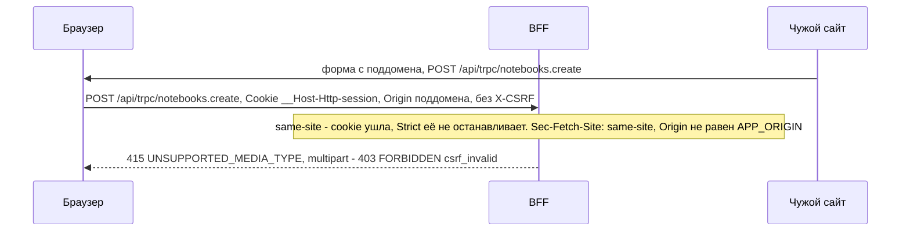
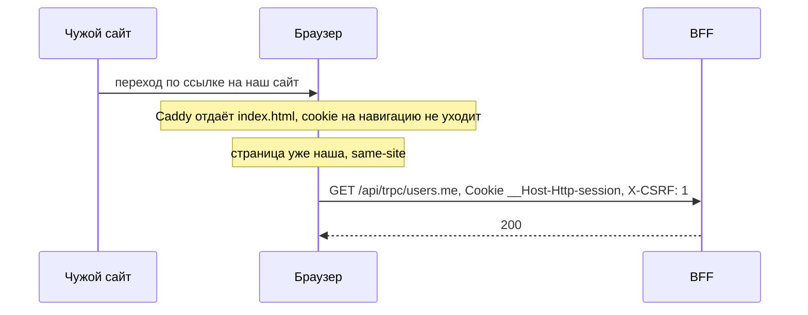
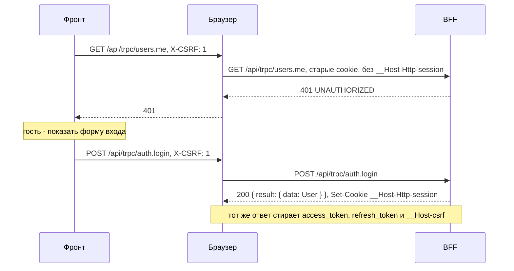

# Миграция на BFF: авторизация и CSRF

Как BFF хранит сессию, обновляет токены и защищается от CSRF, а затем десять сценариев по шагам.
Общая картина — [«Обзор»](../bff), формат ручек — [«Контракт»](./contract). Как защита устроена сейчас —
в разделе [CSRF](/security/csrf/).

## Cookie сессии

BFF держит всю сессию в одной cookie `__Host-Http-session`. Токены Go API лежат внутри неё в
зашифрованном виде, а в браузер не попадает ничего, что JavaScript мог бы прочитать.

| Атрибут | Значение |
|---|---|
| Имя | `__Host-Http-session` |
| `HttpOnly` | да |
| `Secure` | да |
| `Path` | `/` |
| `SameSite` | `Strict` |
| `Domain` | не задаётся |
| `Max-Age` | `refresh_expires_in` из ответа Go |

Значение — `base64url(iv ‖ шифротекст ‖ тег)`: AES-256-GCM, ключ `SESSION_KEY` (32 байта), имя cookie
служит AAD (дополнительные аутентифицируемые данные). `iv` — 12 случайных байт из CSPRNG
(`crypto.getRandomValues`), новые при каждом шифровании; повтор IV с тем же `SESSION_KEY` ломает GCM.
Ошибка расшифровки или тега — сессии нет, и процедуры с сессией отвечают `UNAUTHORIZED`. Внутри — JSON:

```json
{ "access": "…", "refresh": "…", "accessExp": 1760000000, "refreshExp": 1762600000 }
```

*Пример формы; значения токенов и ключа на страницах не приводятся.*

Что говорит RFC 10017. Атрибуты и префикс
([§6.1.3.2](https://www.rfc-editor.org/rfc/rfc10017#section-6.1.3.2)):

> The BFF MUST enable the Secure flag for its cookies.

> The BFF MUST enable the HttpOnly flag for its cookies.

> The BFF SHOULD enable the SameSite=Strict flag for its cookies.

> The BFF SHOULD start the name of its cookie with a prefix indicating the cookie was set via HTTP, for example, by using the __Host-Http- prefix defined in [COOKIES].

Шифрование там же:

> the BFF SHOULD encrypt its cookie contents.

Сессия в самой cookie допустима
([§6.1.2.3](https://www.rfc-editor.org/rfc/rfc10017#section-6.1.2.3)): раз cookie нужна только для
получения токенов, управление и отзыв следуют из access и refresh.

> It suffices to revoke the user's access token and/or refresh token to prevent ongoing access to protected resources, without the need to explicitly invalidate the cookie-based session.

Почему не Redis и не память процесса: BFF остаётся без состояния. Деплой на каждый коммит `main`
никого не разлогинивает, новых сервисов не появляется. Цена: смена `SESSION_KEY` разлогинивает всех.

## Как BFF обрабатывает вызов

Каждый вызов к `/api/trpc` — query, mutation или батч — проходит один путь, включая `auth.login`,
`auth.register` и `auth.logout`:

1. `createContext` проверяет CSRF (раздел «CSRF» ниже). Не прошли — `FORBIDDEN` с `appCode: csrf_invalid`
   (HTTP `403`): роутер не вызывается, в Go ничего не уходит.
2. `createContext` расшифровывает cookie `__Host-Http-session` в `ctx.session`; cookie нет или она не
   расшифровывается — `null`.
3. Все процедуры, кроме `auth.*`, построены на `authedProcedure`: без сессии — `UNAUTHORIZED` (HTTP `401`).
   Несуществующая процедура — `NOT_FOUND` от tRPC (см. [«Контракт»](./contract#какие-вызовы-bff-принимает)).
4. Если до `accessExp` меньше 30 с, `authedProcedure` обновляет токены через refresh до вызова Go.
5. Процедура вызывает Go через `ctx.go` (`GO_API_URL`, на одной VPS `http://api:8080/api/v1`) с
   `Authorization: Bearer`. На двух VPS к нему добавляется `X-BFF-Key`, см. [«Две VPS»](../bff#две-vps).
6. `403 s2s_forbidden` от Go (ключ не принят) — инфраструктурная ошибка: `BAD_GATEWAY` (HTTP `502`),
   запись в лог, refresh не делать, сессию не трогать.
7. Если Go ответил `401`, обновить токены и повторить вызов один раз.
8. Ответить результатом процедуры; если токены сменились, BFF дописывает новую cookie в `resHeaders`.
   Остальные ошибки Go переводятся по таблице [«Ошибки»](./contract#ошибки).

Исключение — `auth.logout`. Он построен на `optionalSessionProcedure`: если сессия есть, вызывает Go тем же
клиентом `ctx.go` — с refresh до вызова и одним повтором после `401`, чтобы refresh-токен отозвался и при
истёкшем access; ошибки Go он не пробрасывает. `auth.logout` никогда не отвечает `UNAUTHORIZED`: после
проверки CSRF он всегда успешен. Без cookie сессии Go не
вызывается; cookie сессии и три старые cookie (`access_token` с `Path=/api/v1`, `refresh_token` с
`Path=/api/v1/auth`, `__Host-csrf` с `Path=/`) стираются в любом случае.

В Go уходят только аргументы процедуры, собранные сгенерированным клиентом, и `X-Request-ID`; `Cookie` и
`X-CSRF` не уходят. `Authorization` и (на двух VPS) `X-BFF-Key` ставит сам BFF, поэтому клиент не может
подсунуть свой `X-BFF-Key`.
Ответ Go в браузер не уходит, только результат процедуры: cookie выставляет только BFF.

Одновременные refresh объединяются. Ключ — SHA-256 refresh-токена, результат держится в памяти
10 с: вторая вкладка со старой cookie получает те же новые токены. Если Go отвергает refresh
(`401`), BFF стирает cookie (`Max-Age=0`) и отвечает `UNAUTHORIZED`.

## CSRF

Три правила, все на стороне BFF (исключение — upgrade WebSocket, см. ниже). Проверки идут первыми из проверок BFF, в `createContext`, раньше расшифровки
cookie, и для каждого вызова, включая вход, регистрацию и выход:

1. Каждый вызов к `/api/trpc` без `X-CSRF: 1` получает `403 csrf_invalid` и в Go не уходит. Чужой
   origin не может поставить такой заголовок без preflight, а CORS BFF не разрешает никому: клиент
   живёт на том же origin.
2. Для `POST` (mutation и батч мутаций): `Origin` равен `APP_ORIGIN`, а `Sec-Fetch-Site`, если он
   есть, равен `same-origin`; иначе `403 csrf_invalid`.
3. `SameSite=Strict`: cookie не уходит на межсайтовые запросы. SPA это не мешает: HTML отдаётся без
   cookie, а запросы к API делает страница того же сайта.

Ещё раньше tRPC сам разбирает запрос: тело не в JSON (`application/x-www-form-urlencoded` и
`text/plain` — так шлёт обычная HTML-форма) он отклоняет `415 UNSUPPORTED_MEDIA_TYPE`, не вызывая
`createContext`. Форма с `multipart/form-data` доходит до проверок CSRF и получает `403`.

Первое правило — прямой путь из RFC
([§6.1.3.3.2](https://www.rfc-editor.org/rfc/rfc10017#section-6.1.3.3.2)):

> When this mechanism is used, the BFF MUST ensure that every incoming request carries this static header.

Подписанный Double Submit, как в нынешней реализации, RFC не ставит выше
([§6.1.3.3.3](https://www.rfc-editor.org/rfc/rfc10017#section-6.1.3.3.3)):

> Note that this mechanism is not necessarily recommended over the CORS approach.

WebSocket (будущая потоковая отдача вывода рантайма) устроен иначе. Браузерный API не умеет ставить
свои заголовки, так что `X-CSRF: 1` на upgrade поставить нельзя: upgrade освобождён от `X-CSRF` и
защищён проверкой `Origin` плюс `SameSite=Strict`. Нет `Origin` или он не равен `APP_ORIGIN` — `403`.
Причина в том, что у WebSocket нет CORS и preflight (Cross-Site WebSocket Hijacking): cookie
`SameSite=Strict` не уйдёт на рукопожатие с чужого сайта, но уйдёт с поддомена того же сайта
([сценарий](#запрос-с-поддомена)), поэтому проверка `Origin` обязательна.

Фронту больше не нужно читать cookie, повторять запрос после `403` и обновлять токены на `401`:
`401` означает гостя и форму входа.

## Сценарии

Участники: `F` — код фронта, `B` — браузер, `P` — BFF, `A` — Go API, `E` — чужой сайт.

### Вход

Фронт шлёт логин с заголовком `X-CSRF: 1`. BFF проверяет заголовок и `Origin`, вызывает Go и
получает токены в JSON. Токены остаются в BFF: браузеру уходят `User` и новая cookie, а три старые
cookie стираются.



*Проект: проверить после внедрения.*

### Запрос данных

BFF расшифровывает cookie и подставляет access токен как `Authorization: Bearer`. Фронт про токены
ничего не знает.



*Проект: проверить после внедрения.*

### Access истёк

Если до `accessExp` меньше 30 с, BFF обновляет токены сам, а потом выполняет исходный запрос.
Фронт делает один запрос и не замечает refresh; новая cookie приходит с обычным ответом.



*Проект: проверить после внедрения.*

### Две вкладки

Две вкладки одновременно приходят со старой cookie, у которой access почти истёк. Refresh
объединяется: Go получает один вызов, обе вкладки получают одни и те же новые токены.



*Проект: проверить после внедрения.*

### Выход

После проверки CSRF процедура `auth.logout` (при истёкшем access — после refresh) вызывает Go с Bearer и `refresh_token` в теле, стирает cookie
и отвечает успехом. Даже если Go вернул `401` (токен уже недействителен), клиент получает успех: сессии
больше нет в любом случае. Без cookie сессии Go не вызывается, а ответ тот же; три старые cookie
стираются всегда.



*Проект: проверить после внедрения.*

### Сессия кончилась

Refresh-токен отозван или не принят Go. Go отвечает `401`, BFF стирает cookie и отвечает
`UNAUTHORIZED`; фронт показывает форму входа. Если refresh просто истёк, браузер уже удалил
cookie (`Max-Age` = `refresh_expires_in`), и `authedProcedure` отвечает `UNAUTHORIZED`, не обращаясь в Go.



*Проект: проверить после внедрения.*

### Атака с чужого сайта

Обычная форма с чужого сайта шлёт тело не в JSON, и tRPC отклоняет её `415 UNSUPPORTED_MEDIA_TYPE`
ещё до проверок BFF; форма с `multipart/form-data` доходит до них и получает `403 csrf_invalid`:
поставить `X-CSRF` она не может. В Go запрос не уходит ни в том, ни в другом случае. `fetch` с заголовком требует preflight, а BFF не разрешает CORS никому, так что
браузер не отправит основной запрос.



*Проект: проверить после внедрения.*

### Запрос с поддомена

Поддомен (скажем, захваченный) находится на том же сайте, поэтому `SameSite=Strict` не помогает:
cookie уходит вместе с запросом. Это именно тот случай, который `SameSite` один не закрывает
([§6.1.3.3.1](https://www.rfc-editor.org/rfc/rfc10017#section-6.1.3.3.1)):

> As a result, a subdomain-takeover attack against b.example.com can enable CSRF attacks against the BFF of a.example.com.

Обычную форму с поддомена tRPC отклонит `415` ещё до проверок BFF, а форма с `multipart/form-data`
не может поставить `X-CSRF` и отклоняется по отсутствию заголовка. Проверка `Origin` и `Sec-Fetch-Site` — вторая линия: она сработала бы и при ошибке в
проверке заголовка или в настройке CORS.



*Проект: проверить после внедрения.*

### Переход по внешней ссылке

Пользователь переходит на сайт по ссылке с чужого сайта. Cookie `Strict` на такую навигацию не
уходит, и Caddy отдаёт `index.html` без неё. Дальше запросы к API делает уже страница нашего сайта, и
cookie с ними идёт.



*Проект: проверить после внедрения.*

### Первый вход после переезда

У пользователя в браузере старые cookie `access_token`, `refresh_token` и `__Host-csrf`, а новой
`__Host-Http-session` нет. Первый же запрос получает `401`, пользователь входит заново, и ответ
входа ставит новую cookie и стирает три старые.



*Проект: проверить после внедрения.*
