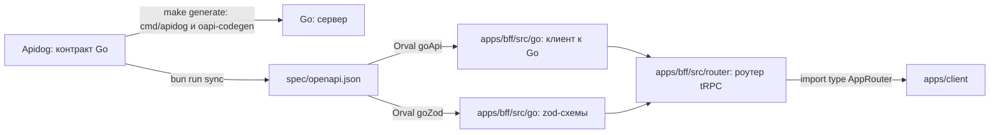

# Миграция на BFF: контракт

Между клиентом и BFF контракт — роутер tRPC: процедуры описаны кодом в BFF, фронт получает их типы
импортом `@cdd/bff` из монорепы фронта. Между BFF и Go контракт остаётся spec-first: Go описан в Apidog, а клиент к нему и
схемы входа генерирует Orval.

## Источники правды



- **Go ↔ BFF.** Контракт Go ведётся в Apidog. Go забирает его сам: `make generate` в бэкенде запускает
  [`go run ./cmd/apidog`](https://github.com/go-park-mail-ru/2026_2_Cringe_Driven_Development/blob/4094350/Makefile#L31)
  и затем `oapi-codegen`. Монорепа выгружает тот же контракт в `spec/openapi.json`, и Orval строит по нему
  клиент к Go и zod-схемы операций для BFF.
- **Клиент ↔ BFF.** Контракт — роутер tRPC в `apps/bff/src/router/`. Клиент делает
  `import type { AppRouter } from '@cdd/bff'`: в бандл не попадает ни строчки кода BFF.
- **Apidog описывает только Go.** Публичного OpenAPI у BFF нет: overlay, публичный контракт и их проверки
  в CI больше не нужны.
- **Валидация.** Вход процедур проверяют zod-схемы, сгенерированные из контракта Go: правило поля
  описано один раз, в Apidog. Выход не проверяется во время работы — типы ответа берутся из Orval, а Go —
  наш сервис.

## Что меняется в контракте Go

Go становится серверным API для BFF, поэтому его контракт в Apidog меняется:

- `TokenPair`: `access_token`, `access_expires_in` (секунды), `refresh_token`, `refresh_expires_in`
  (секунды);
- `/auth/register` → `201 { user: User, tokens: TokenPair }`, `/auth/login` → `200` того же вида;
- `/auth/refresh`: тело `{ refresh_token }` → `200 TokenPair`;
- `/auth/logout`: тело `{ refresh_token }`, `bearerAuth` → `204`;
- у ручек данных остаётся `bearerAuth`; `Set-Cookie`, параметр cookie `refresh_token` и заголовок
  `X-CSRF-Token` уходят.

Контракт уже требует `bearerAuth` у ручек данных, а бэк читает access только из cookie
[`access_token`](https://github.com/go-park-mail-ru/2026_2_Cringe_Driven_Development/blob/4094350/internal/middleware/authenticate.go#L19),
заголовок `Authorization` он не смотрит. После переезда код и контракт сходятся.

## Команды

`bun run sync` выполняет два шага подряд:

1. `apidog` выгружает контракт Go из Apidog в `spec/openapi.json`;
2. `orval` генерирует по нему клиент к Go и zod-схемы (см. ниже).

`spec/openapi.json` коммитится: по диффу видно, что поменялось в контракте Go. Собственный генератор
клиента `openapi-cdd` больше не нужен: клиент берёт типы из роутера, а не из OpenAPI.

## Генерация Orval

`orval.config.ts` в корне монорепы — две цели, обе читают контракт Go:

```ts
import { defineConfig } from 'orval';

export default defineConfig({
  // BFF → Go: fetch-клиент по операциям контракта
  goApi: {
    input: { target: 'spec/openapi.json' },
    output: {
      target: 'apps/bff/src/go/client.ts',
      client: 'fetch',
      baseUrl: 'http://api:8080/api/v1', // на двух VPS мутатор берёт адрес из GO_API_URL
      override: { mutator: { path: 'apps/bff/src/go/fetch.ts', name: 'bearerFetch' } }, // Authorization: Bearer <access>; на двух VPS ещё X-BFF-Key
    },
  },
  // zod-схемы входа процедур
  goZod: {
    input: { target: 'spec/openapi.json' },
    output: {
      target: 'apps/bff/src/go/zod.ts',
      client: 'zod',
    },
  },
});
```

*Пример; точные пути, имена функций и схем — по выгрузке.* Схемы Orval называет по операциям, например
`CreateCellBody` — тело `POST /notebooks/{id}/cells`.

## Роутер

Роутер лежит в `apps/bff/src/router/`, по файлу на ресурс; `index.ts` собирает их в `appRouter`.
Процедуры названы по ресурсам Go:

| Процедура | Тип | Go | Вход |
| --- | --- | --- | --- |
| `auth.register` | mutation | `POST /auth/register` | тело регистрации |
| `auth.login` | mutation | `POST /auth/login` | тело входа |
| `auth.logout` | mutation | `POST /auth/logout` | — |
| `users.me` | query | `GET /users/me` | — |
| `notebooks.list` | query | `GET /notebooks` | — |
| `notebooks.get` | query | `GET /notebooks/{id}` | `{ id }` |
| `notebooks.create` | mutation | `POST /notebooks` | тело создания |
| `cells.create` | mutation | `POST /notebooks/{id}/cells` | `{ notebookId, …тело }` |
| `cells.delete` | mutation | `DELETE /notebooks/{id}/cells/{index}` | `{ notebookId, index }` |

Процедуры обновления токенов нет: refresh делает сам BFF (см.
[«Авторизация и CSRF»](./auth#access-истек)). `auth.login` и `auth.register` построены на `publicProcedure`, `auth.logout` — на
`optionalSessionProcedure`: если сессия есть, она даёт `ctx.go`, но без сессии не отвечает `UNAUTHORIZED`.
Остальные — на `authedProcedure`: она требует сессию и даёт процедуре `ctx.go` — клиент Go с уже свежим
access. Как устроены `createContext` и обе процедуры — в [«Авторизации и CSRF»](./auth).

```ts
// apps/bff/src/router/cells.ts
import { z } from 'zod';
import { authedProcedure, router } from '../trpc';
import { CreateCellBody } from '../go/zod';

export const cells = router({
  create: authedProcedure
    .input(z.object({ notebookId: z.number().int() }).extend(CreateCellBody.shape))
    .mutation(({ ctx, input: { notebookId, ...body } }) => ctx.go.createCell(notebookId, body)),
  delete: authedProcedure
    .input(z.object({ notebookId: z.number().int(), index: z.number().int() }))
    .mutation(({ ctx, input }) => ctx.go.deleteCell(input.notebookId, input.index)),
});
```

```ts
// apps/bff/src/router/index.ts
export const appRouter = router({ auth, users, notebooks, cells });
export type AppRouter = typeof appRouter;
```

*Пример; имена схем и методов клиента Go — по выгрузке Orval.*

## Процедуры экранов

Процедура ресурса — одно действие или один ресурс. Если экрану нужно больше одного вызова Go, для него
заводится процедура в роутере `views`: она делает вызовы Go параллельно и отдаёт один ответ. Процедуры
ресурсов остаются для действий и отдельных виджетов.

Сейчас каждый экран фронта делает по одному запросу: список блокнотов —
[`GET /notebooks`](https://github.com/frontend-park-mail-ru/2026_2_Cringe_Driven_Development/blob/344ad0b/src/pages/NotebooksPage/NotebooksPage.tsx#L32),
блокнот —
[`GET /notebooks/{id}`](https://github.com/frontend-park-mail-ru/2026_2_Cringe_Driven_Development/blob/344ad0b/src/pages/NotebookPage/NotebookPage.tsx#L38),
поэтому процедур экранов пока нет.

::: info
`views.notebook` появится вместе с треком [«Авто-VPS»](../notebook-vps): странице блокнота понадобится и
сам блокнот, и статус его окружения.
:::

```ts
// apps/bff/src/router/views.ts
export const views = router({
  notebook: authedProcedure
    .input(z.object({ id: z.number().int() }))
    .query(async ({ ctx, input }) => {
      const [notebook, runtime] = await Promise.all([ctx.go.getNotebook(input.id), ctx.go.getRuntime(input.id)]);
      return { notebook, runtime };
    }),
});
```

*Пример; `getRuntime` — будущая ручка трека «Авто-VPS».*

## Ошибки

Go отвечает на ошибку телом `Error { code, message }`. BFF переводит её в ошибку tRPC:

| Ответ Go | Ошибка tRPC | Что ещё |
| --- | --- | --- |
| `400` | `BAD_REQUEST` | |
| `401` после неудачного refresh | `UNAUTHORIZED` | cookie сессии стирается |
| `403` | `FORBIDDEN` | |
| `404` | `NOT_FOUND` | |
| `409` | `CONFLICT` | |
| `403 s2s_forbidden`, `5xx`, сеть | `BAD_GATEWAY` | запись в лог, сессия не трогается |

`errorFormatter` роутера добавляет в `data`:

- `appCode` — код приложения: `Error.code` от Go или код BFF (`csrf_invalid`). Клиент показывает
  сообщения по `appCode`, а не по тексту `message`;
- `zodError` — `error.flatten()`, если вход не прошёл схему (`BAD_REQUEST`).

`stack` в прод не уходит.

```json
{
  "error": {
    "message": "Блокнот не найден",
    "code": -32004,
    "data": { "code": "NOT_FOUND", "httpStatus": 404, "path": "notebooks.get", "appCode": "notebook_not_found" }
  }
}
```

*Пример; коды приложения — из контракта Go.*

## Клиент

Сторонних runtime-библиотек на клиенте нет, поэтому клиент tRPC свой: пакет `@cdd-team/trpc-client` в
монорепе фронтовых библиотек [`frontend-packages`](https://github.com/Cringe-Driven-Development-Team/frontend-packages) (`packages/trpc-client`). Оттуда он
публикуется в npm вместе с остальными библиотеками, фронт ставит его зависимостью — подтрек
[«tRPC (client)»](../trpc-client). Типы он берёт из `@trpc/server` только через `import type` — `inferRouterInputs` и
`inferRouterOutputs`, — и в бандл `@trpc/server` не попадает.

```ts
import { createClient } from '@cdd-team/trpc-client';
import type { AppRouter } from '@cdd/bff';

export const api = createClient<AppRouter>({ url: '/api/trpc' });

const notebook = await api.notebooks.get.query({ id });
await api.cells.create.mutate({ notebookId: id, kind: 'code' });
```

Протокол — [HTTP RPC tRPC 11](https://trpc.io/docs/rpc):

- query — `GET /api/trpc/<процедура>?input=<encodeURIComponent(JSON)>`;
- mutation — `POST /api/trpc/<процедура>` с JSON в теле;
- батч — процедуры через запятую в пути, `?batch=1`, `input` — объект по индексам вызовов; ответ — массив
  конвертов в том же порядке, при разных статусах — `207`;
- успех — `{ "result": { "data": … } }`, ошибка — `{ "error": { "message", "code", "data" } }`
  (см. [«Ошибки»](#ошибки)).

Что делает клиент:

- на каждый запрос ставит `X-CSRF: 1` и `credentials: 'same-origin'`;
- вызовы одного метода в одном тике собирает в один батч; URL длиннее 2000 символов делит на несколько
  запросов;
- если ошибка возникла в `createContext` (например, CSRF), на батч приходит один конверт `{ error }`, а не
  массив: клиент отдаёт эту ошибку каждому вызову батча;
- ошибку бросает как `TrpcError { code, httpStatus, appCode, message, zodError? }`; на `UNAUTHORIZED` стор
  сессии переходит в «гость», и фронт показывает форму входа.

Подписок пока нет. Потоковый вывод ячеек, когда понадобится, пойдёт через SSE на `fetch`: у `EventSource`
нельзя поставить заголовок `X-CSRF`.

Клиент проверяется тестами на подставном `fetch`:

```ts
test('батч двух query — один GET и два результата', async () => {
  const calls: string[] = [];
  const fetch = async (url: string) => {
    calls.push(url);
    return Response.json([{ result: { data: { id: 1 } } }, { result: { data: [] } }]);
  };
  const api = createClient<AppRouter>({ url: '/api/trpc', fetch });
  const [notebook, list] = await Promise.all([api.notebooks.get.query({ id: 1 }), api.notebooks.list.query()]);
  expect(calls).toEqual([`/api/trpc/notebooks.get,notebooks.list?batch=1&input=${encodeURIComponent('{"0":{"id":1}}')}`]);
  expect([notebook, list]).toEqual([{ id: 1 }, []]);
});

test('ошибка createContext на батч — один конверт для всех вызовов', async () => {
  const fetch = async () =>
    Response.json(
      { error: { message: 'csrf', code: -32003, data: { code: 'FORBIDDEN', httpStatus: 403, appCode: 'csrf_invalid' } } },
      { status: 403 },
    );
  const api = createClient<AppRouter>({ url: '/api/trpc', fetch });
  const results = await Promise.allSettled([api.users.me.query(), api.notebooks.list.query()]);
  expect(results.map((r) => r.status === 'rejected' && (r.reason as TrpcError).appCode)).toEqual(['csrf_invalid', 'csrf_invalid']);
});
```

*Пример; так же проверяются одиночный вызов и конверт ошибки процедуры.*

## Какие вызовы BFF принимает

[RFC 10017 §6.1.3.6](https://www.rfc-editor.org/rfc/rfc10017#section-6.1.3.6):

> When implementing a dynamically configurable proxy, the BFF MUST ensure that it only allows requests to explicitly permitted hosts and paths.

BFF ничего не проксирует, поэтому требование выполняется устройством: Go вызывается только из процедур
роутера и только сгенерированным клиентом, а путь и метод каждого вызова Go заданы в коде процедуры.

Проверки CSRF идут раньше роутера (см. [«Авторизация и CSRF»](./auth#как-bff-обрабатывает-вызов)), поэтому
вызов без `X-CSRF` получит `403`. Вызов несуществующей процедуры получает `404 NOT_FOUND` от tRPC без
запроса в Go:

```http
POST /api/trpc/notebooks.delete
Content-Type: application/json
X-CSRF: 1
Origin: https://cellestial.ru

404 Not Found
{ "error": { "message": "No procedure found on path \"notebooks.delete\"", "code": -32004, "data": { "code": "NOT_FOUND", "httpStatus": 404, "path": "notebooks.delete" } } }
```

*Пример; удаления блокнота в контракте нет.*
